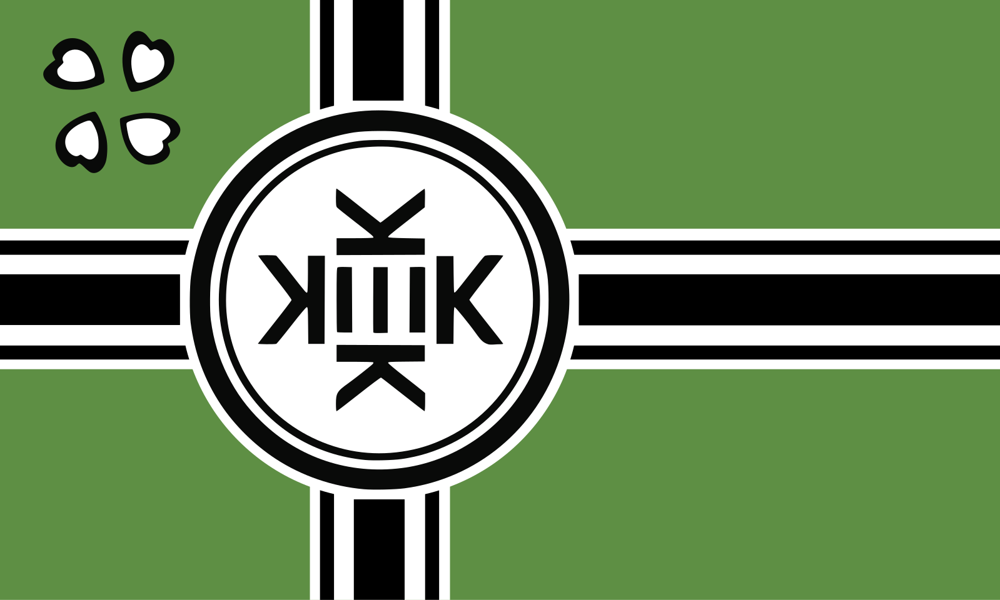

# Kekistan — a Hearts of Iron IV mod

Turns Germany into Kekistan: new flag, new name, dark green on the map.



## What it changes

| Thing | File |
| --- | --- |
| Flag (all sizes + every ideology variant) | `Kekistan/gfx/flags/**/GER*.tga` |
| Map / UI colour → dark green `40 90 40` | `Kekistan/common/countries/Germany.txt` |
| Country name → Kekistan | `Kekistan/localisation/english/kekistan_l_english.yml` |

The name change covers the base tag and all four ideologies, so it stays
Kekistan whether the country is fascist, democratic, communist or non-aligned:

* Fascist — *The Kekistani Reich*
* Democratic — *The Republic of Kekistan*
* Communist — *The Kekistani Soviet Republic*
* Non-aligned — *The Kingdom of Kekistan*

Adjective is *Kekistani* throughout.

## Install

Copy `Kekistan/` **and** `Kekistan.mod` into your HOI4 mod folder:

* Windows — `%USERPROFILE%\Documents\Paradox Interactive\Hearts of Iron IV\mod\`
* Linux — `~/.local/share/Paradox Interactive/Hearts of Iron IV/mod/`
* macOS — `~/Documents/Paradox Interactive/Hearts of Iron IV/mod/`

You should end up with `.../mod/Kekistan.mod` and `.../mod/Kekistan/descriptor.mod`.
Launch HOI4, enable **Kekistan** in the launcher's playset, and start a game.

## Notes

* `common/countries/Germany.txt` is a whole-file override, so this conflicts
  with any other mod that changes Germany's colour or graphical culture. It is
  a three-line file — merge by hand if you need to.
* The flags are plain uncompressed 32-bit TGAs at HOI4's three sizes
  (82×52, 41×26, 10×7), one per ideology, downscaled from the artwork in
  `tools/kekistan_flag.png`.
* `supported_version` is set to `1.16.*`. Nothing here touches gameplay
  scripting, so bumping it for a newer patch is safe.

## Regenerating the flags

The TGAs are cut from `tools/kekistan_flag.png` by a script, so swapping the
art is a matter of replacing that one file:

```sh
pip install pillow
python3 tools/generate_flags.py
```

That rewrites all fifteen TGAs. The source is 1599x960 (5:3) and HOI4 flags are
roughly 1.58:1, so the resize squeezes it horizontally by about 5% — the same
thing vanilla does to its own flags.
